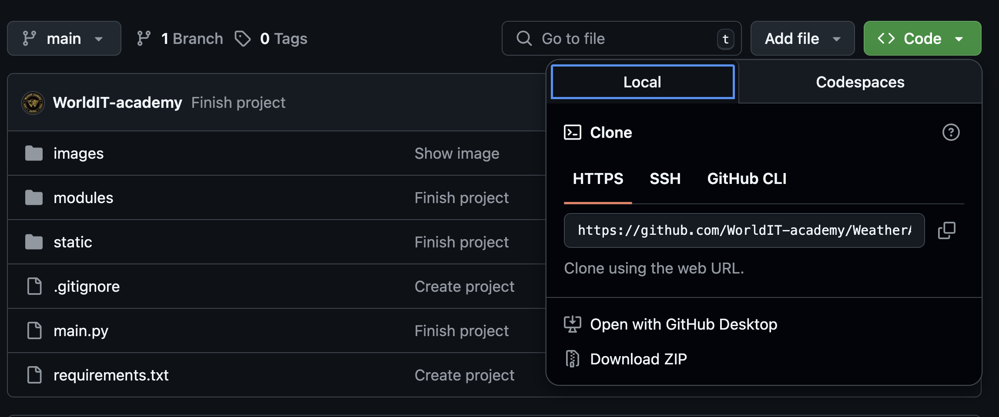
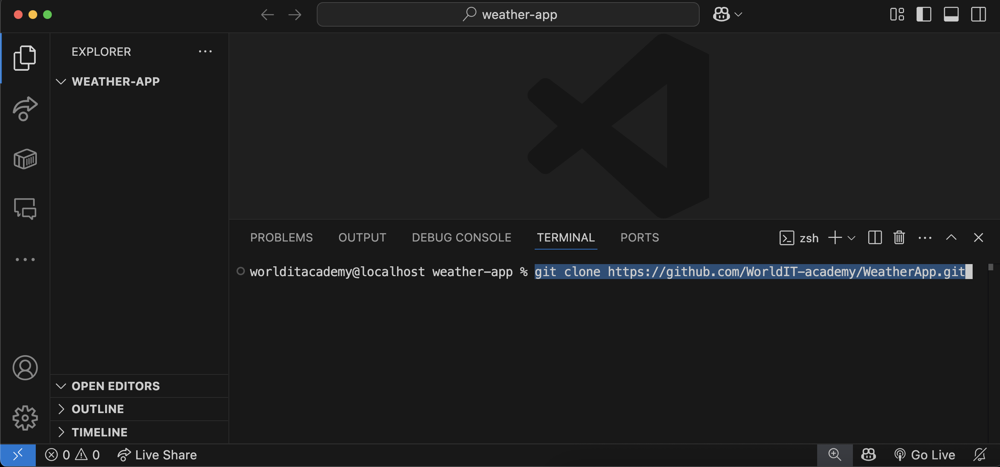

# WEATHER APPLICATION

This project was developed to familiarize with the work of the API, the principle of receiving data from a remote server, the ability to process, structure and apply it in your project. Namely, the API of such a web resource as [OpenWeatherMap](https://openweathermap.org) was used. The project will help to understand the work of JSON files, how to correctly receive and store data in files with the .json type. And to introduce the user to the application interface developed using the [CustomTkinter](https://customtkinter.tomschimansky.com) package.

### Content:
- [Main project modules](#modules)
- [Project deployment](#download)
- [Creating a virtual project environment](#venv)
- [All commands need for start project](#terminal)
- [Loading modules into the virtual environment](#download-venv)
- [Project start](#start-project)
- [Main project mechanics](#mechanics)
- [Project conclusion](#result)

### Modules
 All modules:
  1. [customtkinter](https://customtkinter.tomschimansky.com)
  2. [json](https://docs.python.org/3/library/json.html)
  3. [colorama](https://pypi.org/project/colorama/)
  4. [os](https://docs.python.org/uk/3.13/library/os.html)
  5. [requests](https://pypi.org/project/requests/)
  6. [pillow](https://pypi.org/project/pillow/)
  7. [datetime](https://docs.python.org/3/library/datetime.html)

### Download
 Downloading project
- ##### Git clone:

    - Get a link to clone the project

    

    - Open VSCode --> in VSCode Explorer, open the folder to save the cloned project --> and in Terminal, type the command: 
    - `git clone https://github.com/WorldIT-academy/WeatherApp.git`

    

    - Open the directory you cloned in VSCode Explorer
    
- ##### Download ZIP

### Vemv
 How to create virtual environment:
  Windows:
   1. python -m venv venv
   2. source venv/Scripts/activate

  Mac:
   1. python3 -m venv venv
   2. source venv/bin/activate

### Terminal
 All actions in terminal to start project:
  Windows
   1. git clone https://github.com/SergiyMandryka/Weather-App.git
   2. cd WeatherApp
   3. python -m venv venv
   4. source venv/Scripts/activate
   5. pip install customtkinter; pip install json; pip install colorama; pip install os; pip install requests; pip install pillow; pip install datetime
   6. pip install -r requirements.txt

  Mac:
   1. git clone https://github.com/SergiyMandryka/Weather-App.git
   2. cd WeatherApp
   3. python3 -m venv venv
   4. source venv/bin/activate
   5. pip install customtkinter; pip install json; pip install colorama; pip install os; pip install requests; pip install pillow; pip install datetime
   6. pip install -r requirements.txt

### Download venv
 How to download modules to venv:
  1. pip install customtkinter
  2. pip install json
  3. pip install colorama
  4. pip install os
  5. pip install requests
  6. pip install pillow
  7. pip install datetime

### Start project
 How start project:
  1. After you have installed everything you need, go to the main.py file and click on the button with the name: Run Python File
  2. Enter your name and the city you are in
  3. After that you can open us app and enjoy it 

### Mechanics
 Main mechanics of the project:
  1. [VisualStudioCode](https://code.visualstudio.com/)
  2. [Python](https://www.python.org/)
  3. [OpenWeatherMap](https://openweathermap.org)
  4. [CustomTkinter](https://customtkinter.tomschimansky.com)

### Result:
During the creation of this project I learned to work with API and also learned to work with CustomTkinter
